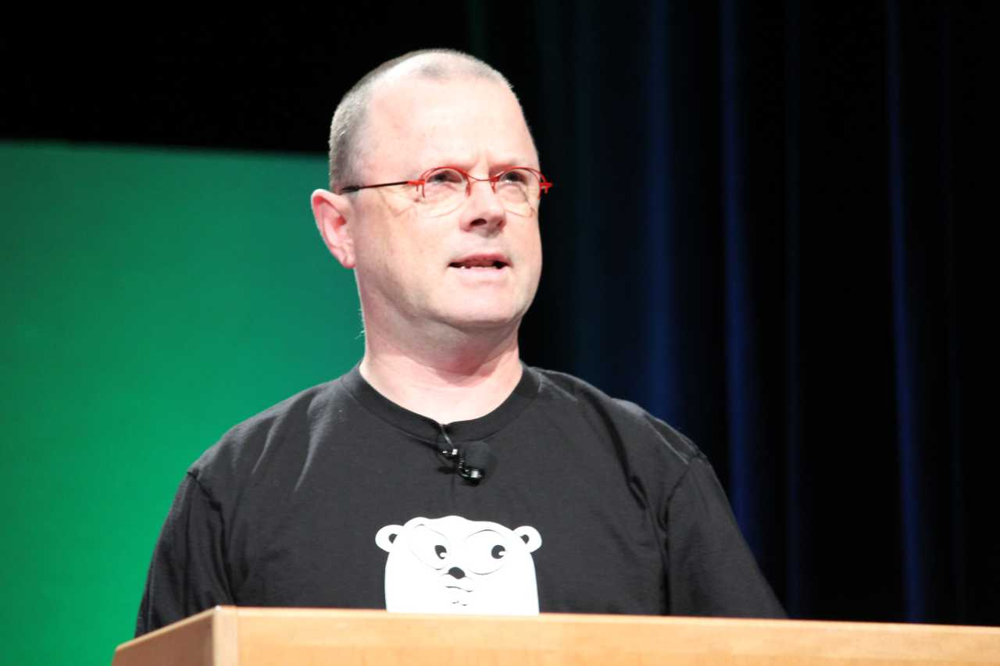

# What is Go

> Go is a **statically typed**, **compiled programming language** designed at Google

Who designed it?
- Robert Griesemer <!-- .element: class="fragment" -->
- Rob Pike <!-- .element: class="fragment" -->
- Ken Thompson <!-- .element: class="fragment" -->

Who are they?

Member of the Unix team

He designed and implemented the original Unix operating system

Fun fact: who is the other guy in the picture?

He is ...

Dennis Ritchie

If you don't konw who he is, then 😱😱😱
